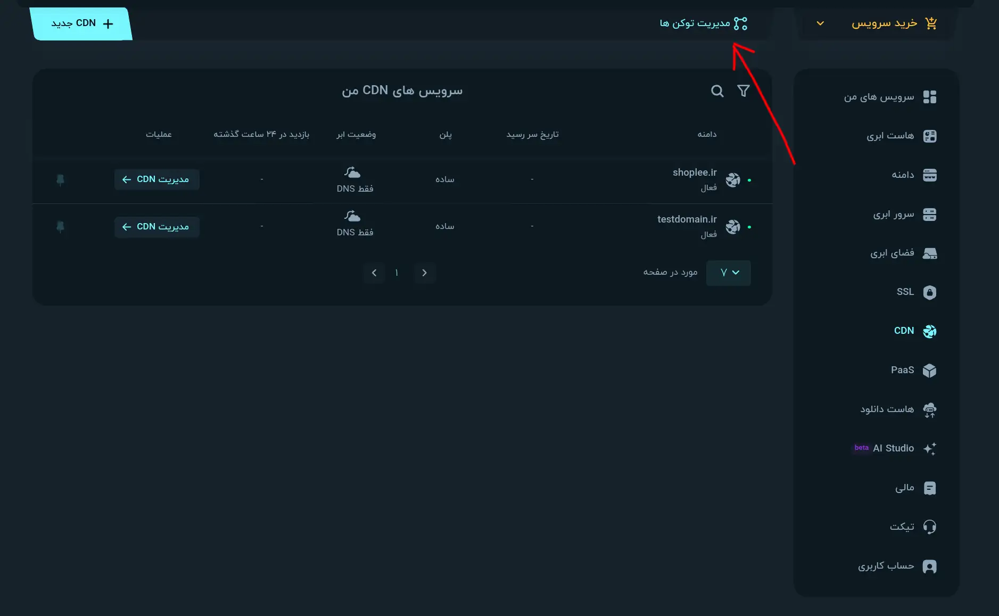
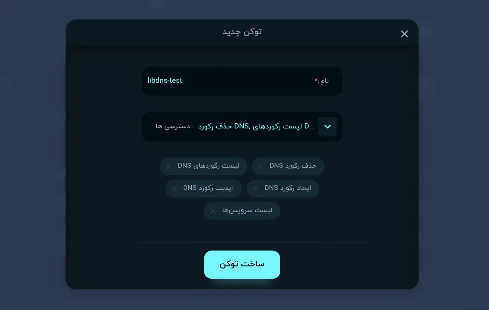

ParsPack for [`libdns`](https://github.com/libdns/libdns)
=======================

[](https://pkg.go.dev/github.com/libdns/parspack)

This package implements the [libdns interfaces](https://github.com/libdns/libdns) for ParsPack, allowing you to manage DNS records.

## Authentication

1. You need to a zone (domain) in your ParsPack panel.
2. Go to CDN Sections and you can see the button for creating a new token.



3. Create a new API token with the following scopes:



- لیست سرویس‌ها
- لیست رکوردهای DNS
- ایجاد رکورد DNS
- آپدیت رکورد DNS
- حذف رکورد DNS


## Example Configuration

```golang
p := parspack.Provider{
    APIToken: "your-apitoken-here",
}
```
